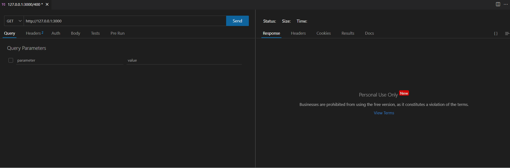

# nest-response-module

A module for unifying the response and exception return structure（一个用于统一响应和异常的返回结构的模块）

See👀: [./src/response/response.module.ts](./src/response/response.module.ts)

